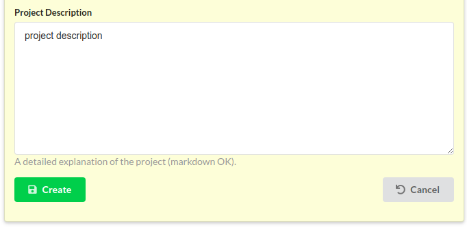

## Collaborative Analysis in Bioinformatics 
 
Natay Aberra 
Aswathy Sebastian 
Istavan Albert 

---

## Introduction 

- __Dr. Istvan Albert__ 
- __Aswathy Sebastian__ 
- __Natay Aberra__ 

---

## Metabarcoding project

Classify population of fish using different analytic pipelines and compare their results.

We wrote our pipelines with around the idea that they sound be tunable and reproducible. 

Ideally, a pipeline written to classify fish should be able to classify anything else. 

---

## Broader issue 

In many cases, one lab can not recreate the results of another even if both start with the same data set.

- __Problem__ : Bioinformatics is experiencing a _reproducibility crisis_. 
- __Solution__ :  A web application allowing scientists to document, execute and share data analysis scripts. 
    - We call these analysis scripts ___recipes___. 
  
---
## Biostar-Engine: A sharing platform

Source code : https://github.com/biostars/biostar-engine

The website is designed to run and share recipes, by doing the following:

- Generates an easy-to-use graphical interface to command line tools
- Supports public and private project-based work-flows
- Data storage

---
## What is a bioinformatics recipe?

__Recipe__: a collection of commands + a graphical user interface.

It may be a bash script, an R script, a series of mothur instructions. Basically any list of commands that can be executed in an environment.

---
___Is a recipe a "pipeline"?___
Yes. A recipe may be thought of as a web-enabled pipeline execution environment.

___What is the purpose of a recipe?___
Recipes allow other people to run scripts that you have written. When executed a recipe creates a full record of a data analysis run. 

___How can you get someone's recipe?___
Just copy it! Anyone that can see a recipe can copy their own version of it. 

---

## Where to start

1. Create a project
    - Projects act as containers for recipes, data, and analytic results.
    
2. Add data to a project
    - Several methods to add data, some have restrictions on size.

3. Create a recipe 
    - Create a blank recipe or copy one and edit it.

4. Run the recipe and view results
    - Running a recipe creates a set of files that can be downloaded or re-ran in another recipe.

---
## General structure 

Each project has three distinct sections:

- __Data__: Sequencing runs, sample sheets, etc.
- __Recipes__: Graphic interface + pipeline
- __Results__: files generated from running recipes

---

# Access levels

There are three access types a user can have to a project:
- `READ` : only see content
- `READ` + `WRITE` : see, edit, add data, create and run recipes.
- `READ` + `WRITE` + `MANAGE` : add/remove users from project.

In the same sense, a project has two states: 

- `PUBLIC` : everyone has `READ` access to the project.

- `PRIVATE`: the owner and users added by the project manager have `READ` access.

---
### Create a project

To create a project, click the `Create Project` button found at the bottom of the `Project List` page.

This opens a form with a `Create` button at the bottom. Click `Create` to get full `READ` + `WRITE` + `MANAGE` access to the project and begin adding data.

---
## Adding data
Once your project has successfully been created, you will be redirected to this page.

Press the `Data` tab and click `Add Data` link found on that page. 

---

You will be able to upload a file ( < 25 MB ) __or__ write data into a text box.

---
### Attached information

Data will have extra "attached" information, which can be specified when adding and changed at any time.

The most important of these being __`Data Type`__

---

__Data Type:__

This is used to sub-select for data in recipe drop-downs.

