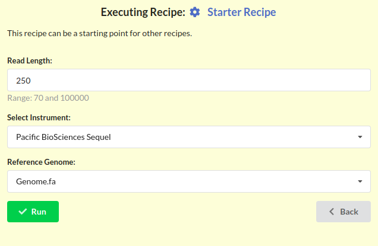
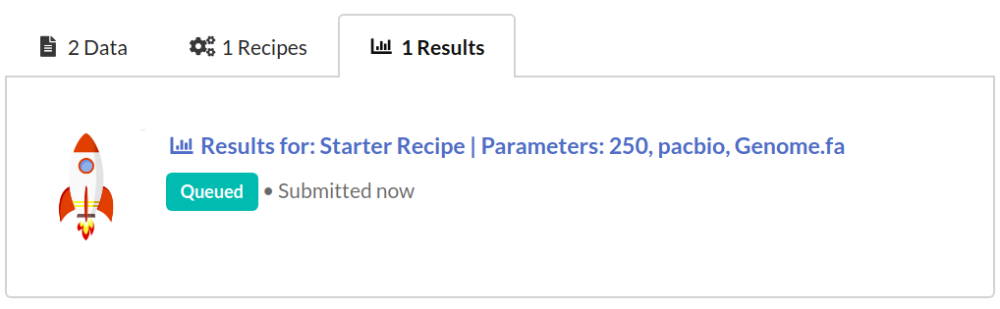
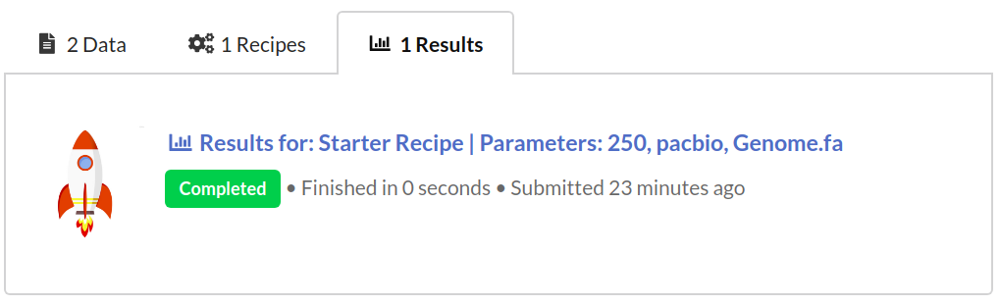
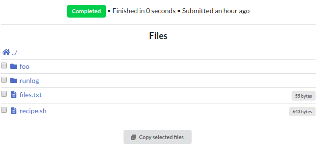
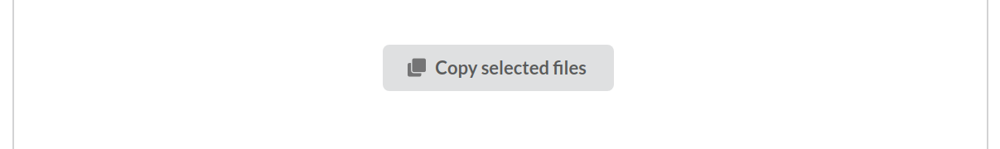
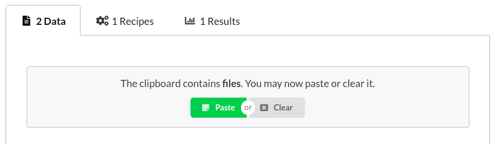

## Collabrative Ananlysis in Bioinformatics 
 
Natay Aberra 
Aswathy Sebastian 
Istavan Albert 

---

## Introduction 

- __Dr. Istvan Albert__ 
- __Aswathy Sebastian__ 
- __Natay Aberra__ 

---

## Metabarcoding project

Classify population of fish using different analytic pipelines and compare their results.

We wrote our pipelines with around the idea that they sound be tuneable and reproducible. 

Idealy a pipeline written to classify fish should be able to classify anything else. 

---

## Broader issue 

In many cases, one lab can not recreate the results of another even if both start with the same data set.

- __Problem__ : Bioinformatics is experiencing a _reproducibility crisis_. 
- __Solution__ :  A web application allowing scientists to document, execute and share data analysis scripts. 
	- We call these analysis scripts ___recipes___. 
  
---
## Biostar-Engine: A sharing platform

Source code : https://github.com/biostars/biostar-engine

The website is designed to run and share recipes, by doing the following:

- Generates an easy-to-use graphical interface to command line tools
- Supports public and private project-based workflows
- Data storage

---
## What is a bioinformatics recipe?

__Recipe__: a collection of commands + a graphical user interface.

It may be a bash script, an R script, a series of mothur instructions. Basically any list of commands that can be executed in an environment.

---
___Is a recipe a "pipeline"?___
Yes. A recipe may be thought of as a web enabled pipeline execution environment.

___What is the purpose of a recipe?___
Recipes allow other people to run scripts that you have written. When executed a recipe creates a full record of a data analysis run. 

___How can you get someones recipe?___
Just copy it ! Anyone that can see a recipe can copy their own version of it. 

---

## Where to start

1. Create a project
	- Projects act as containers for recipes, data, and analytic results.
	
2. Add data into project
	- Several methods to add data, some have restirctions on size.

3. Create a recipe 
	- Create a blank recipe or copy one and edit it.

4. Run the recipe and view results
	- Running a recipe creates a set of files that can be downloaded or re-ran in another recipe.

---
## General structure 

Each project has three distinct sections:

- __Data__: Sequencing runs, sample sheets, etc.
- __Recipes__: Graphic interface + pipeline
- __Results__: files generated from running recipes

---
# Access levels

There are three access types a user can have to a project:
- `READ` : only see content
- `READ` + `WRITE` : see, edit, add data, create and run recipes.
- `READ` + `WRITE` + `MANAGE` : add/remove users from project.

In the same sense, a project has two states: 

- `PUBLIC` : everyone has `READ` access to the project.

- `PRIVATE`: the owner and users added by the project manager have `READ` access.

---
### Create a project

To create a project, click the `Create Project` button found at the bottom of the `Project List` page.

This opens a form with a `Create` button at the bottom. Click `Create` to get full `READ` + `WRITE` + `MANAGE` access to the project and begin adding data.

---
## Adding data
Once your project has succusfully been created, you will be redirected to this page.

Press the `Data` tab and click `Add Data` link found on that page. 

---

You will be able to upload a file ( < 25 MB ) __or__ write data into a text box.

---
### Attached information

Data will have extra "attached" information, which can be specified when adding and changed at any time.

The most important of these being __`Data Type`__

---

__Data Type:__

This is used to sub-select for data in recipe dropdowns.

__Large data ( > 25 MB):__ 

We currently add it manually from the command line. An FTP server will be used in the final version of the website.

__Copying from other places__:

Copy files from results or other projects you have access to.
More efficient since data already exists

---
## Create a recipe 

The simplest way to create a recipe is to copy an existing recipe from another project. 

Visit a project that has recipes, select the `Recipes` tab, select the recipe of interest, then press the `Copy Recipe` button.

---

Navigate to a project that you have created then in the `Recipes` tab select the `Paste Recipe` button that is now visible to you.

---
### Run a recipe

To run a recipe, select the desired recipe and press the `Run Recipe` button.

This creates an interface page with a `Run` button at the bottom

---

Clicking `Run` on the interface page creates a result in a `Queued` state

If the recipe has finished successfully, it changes into `Completed`

---
### Gathering result files
Results produce files inside of the working directory. 
`recipe.sh` holds the live script that can be downloaded an ran on any system.

Files or directories can be copied into a project you have `WRITE` access to.

---
## Copying files
Click the `Copy selected files` at the bottom of the files listing.

Navigate to a project you have `WRITE` access to, then in the data tab click the `Paste` button now visible.

---

# Live Demo!
https://www.bioinformatics.recipes/

---

# Extra Information on building recipes

---

#### Bioinformatic Recipes 

A recipe is a pipeline with an added graphical interface ( GUI ).
1. The commands may be any list of commands that can be executed in an environment. `echo "Hello World!"`
  
2. The GUI spec is a file in JSON (Javascript Object Notation).

      
        {
            cutoff: {
                label: P-Value Cutoff
                display: FLOAT
                value: 0.05
                range: [ 0, 1]
                }
        }
   
 	

---
## How do I use a parameter in the script template?

If you have a parameter called cutoff as above you can use it in a recipe as `{{ cutoff.value }}`.

The placeholder `{{ cutoff.value }}` will get substituted with the user selection in your script. If your script is in bash you could write:

	echo "You selected a cutoff of: {{ cutoff.value }}"
